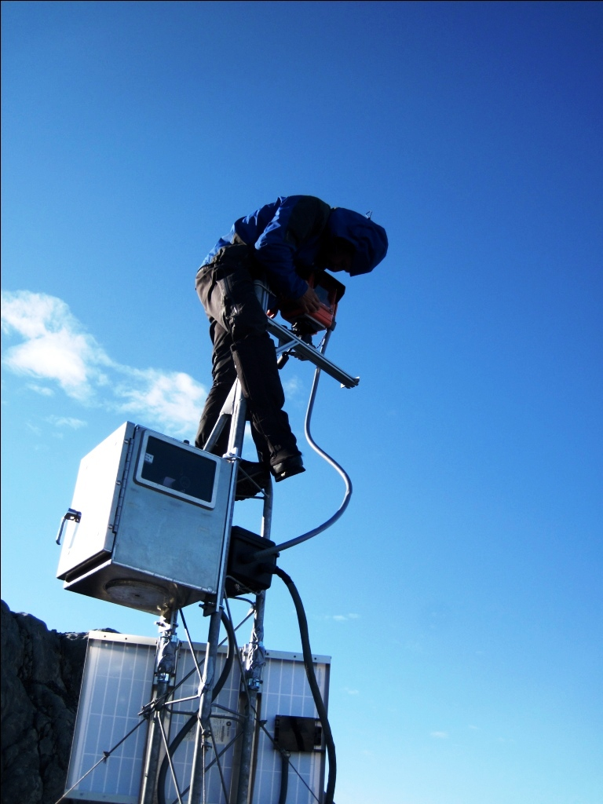
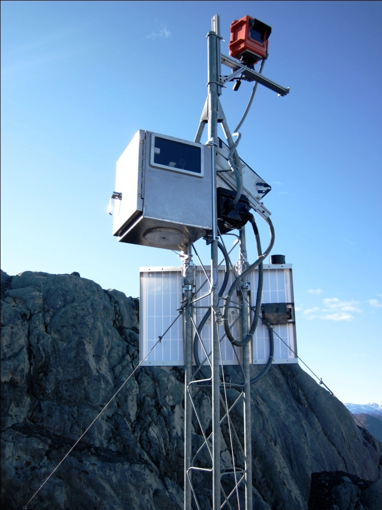
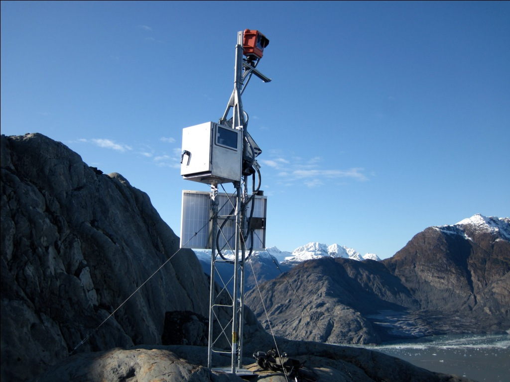
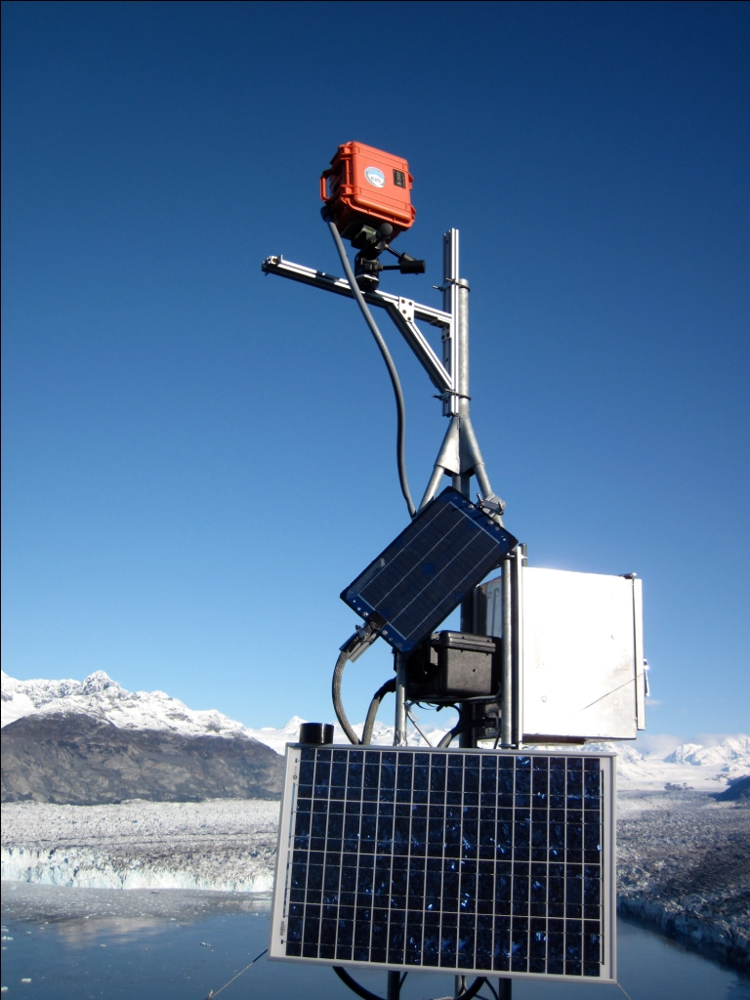

In the Fall of 2011, researchers from the USGS (Dr. Shad ONeel) and CRREL worked to deploy a realtime Iridium web camera at Columbia Glacier. The camera is focused on the central terminus of Columbia Glacier and captures up to 4 images per day in optimal lighting conditions. The camera operated succesfully until late November when it suffered a power failure. We are currently working on a schedule to make repairs to the camera. 

  

  

    
    

	New satellite-linked camera installed at Columbia Glacier. Credit: Shad O'Neel, USGS.
    

  

  

  

  

    
    

	Tower with Extreme Ice Survey camera and CRREL satellite-linked camera. Credit: Shad O'Neel, USGS.
    

  

  

  

  

    
    

	Both cameras capture images of the terminus. Credit: Shad O'Neel, USGS.
    

  

  

  

  

    
    

	The cameras are battery powered, with solar panels for charging. Credit: Shad O'Neel, USGS.
    

  

  

