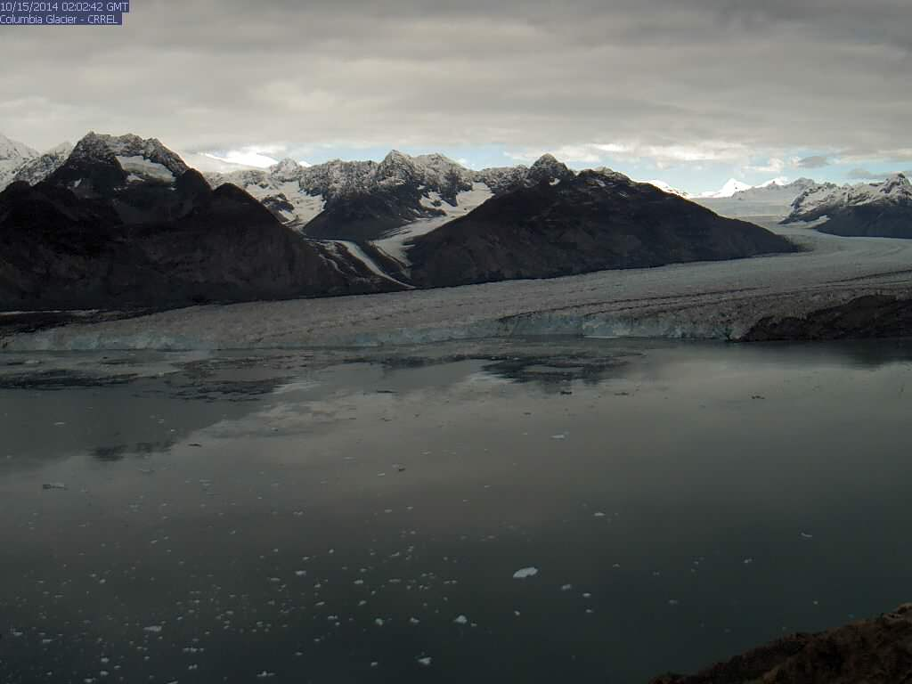

Our colleagues at the USGS Alaska successfully replaced the old time-lapse camera installed at Columbia Glacier this week with our latest designed system. Capturing and transmitting images every 3-hours during daylight, this camera will help to track the movement of Columbia Glacier, which has been in accelerated retreat since the early 1980's. Near real-time images can be viewed on the **[Columbia Glacier Real-time Images](\locations/columbia/realtime-images.html)** page.

  

  

    
    

	Image of Columbia Glacier taken from the newly installed satellite-linked time-lapse camera. Images are captured every 3-hours during daylight.
    

  

  

