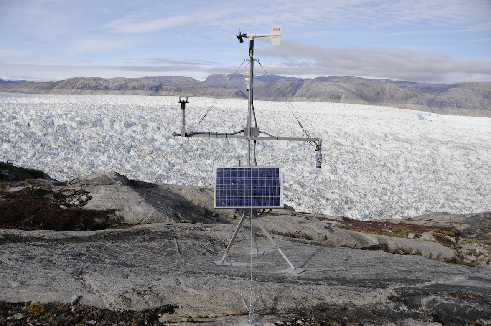
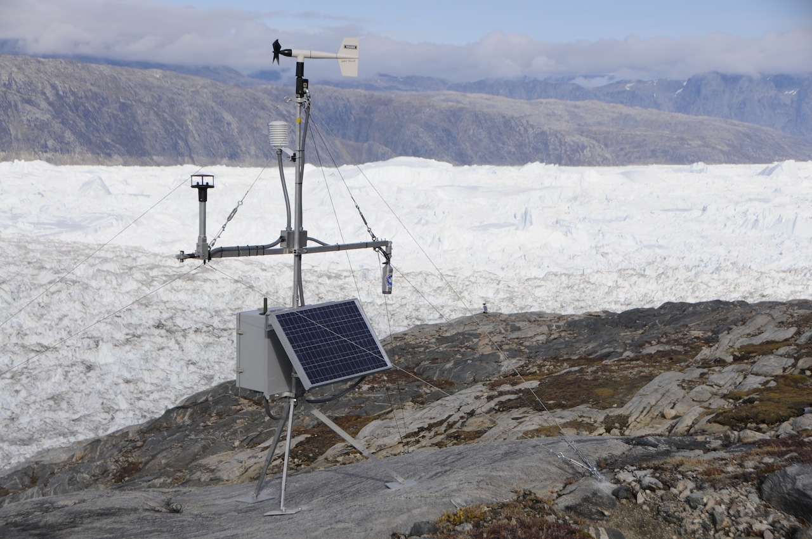
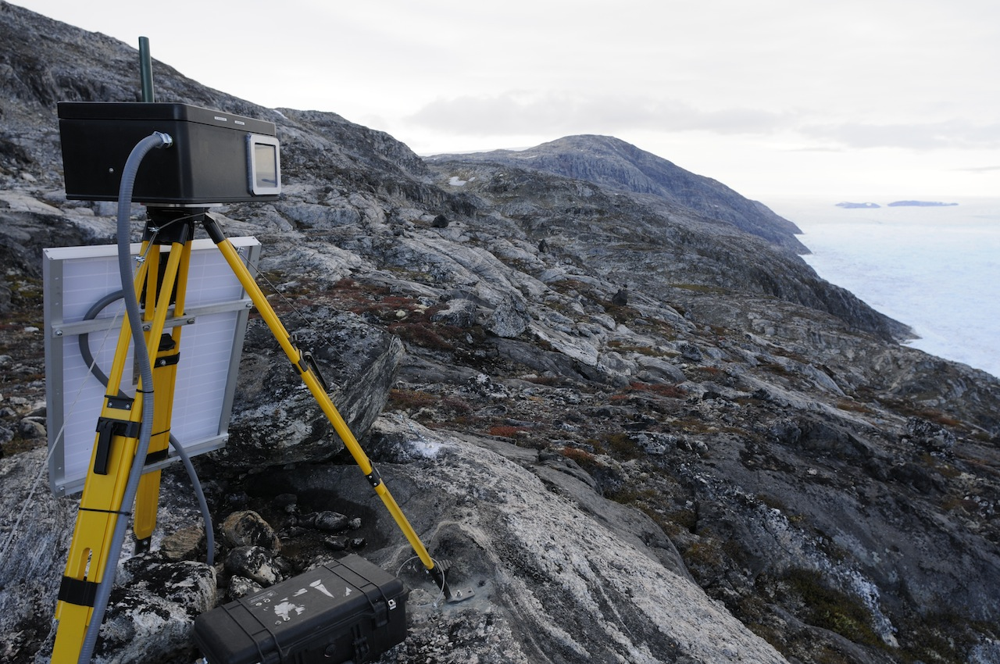
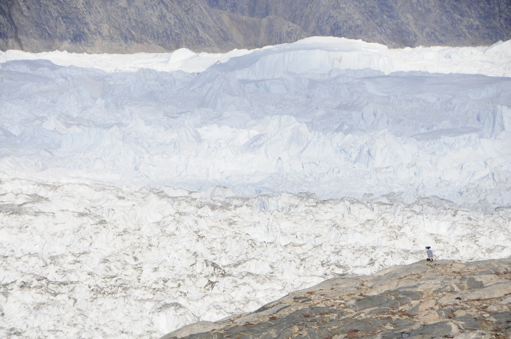
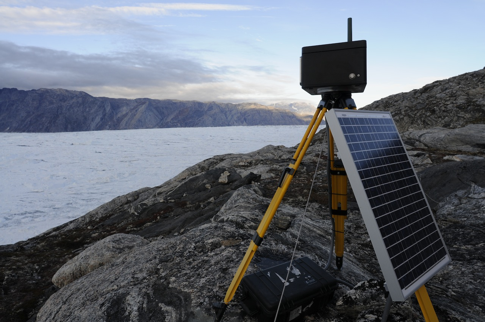

In the Fall of 2011, researchers from the University of Maine (Dr. Gordon Hamilton) and CRREL worked to deploy a new automated climate station and two realtime Iridium web cameras at Helheim Glacier. All of these systems were deployed along the southern margin of the glacier to monitor climate, ice and pro-glacial activity. Due to a late deployment schedule a series of technical difficulties prevented the terminus camera from operating correctly. Furthermore, the climte station operated till December but has since become unavailable. Both of these issues will be repaired in the early spring 

  

  

    
    

	New climate station installed on south side of Helheim Glacier, Greenland. Credit: Adam LeWinter, CRREL.
    

  

  

  

  

    
    

	New climate station installed on south side of Helheim Glacier, Greenland. Camera installation visible in background. Credit: Adam LeWinter, CRREL.
    

  

  

  

  

    
    

	Iridium-linked time-lapse camera focused on Helheim Glacier. Credit: Adam LeWinter, CRREL.
    

  

  

  

  

    
    

	Time-lapse camera focused on the Helheim Glacier terminus, transmitting images daily. Credit: Adam LeWinter, CRREL.
    

  

  

  

  

    
    

	Time-lapse camera focused on the Helheim Glacier terminus, transmitting images daily. Credit: Adam LeWinter, CRREL.
    

  

  

