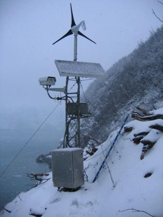
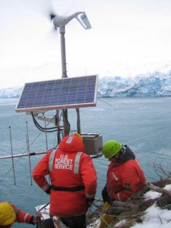
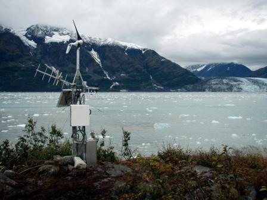
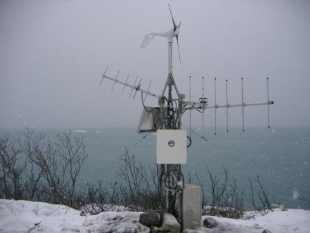

 A second site visit to Haenke Island and Gilbert point made on December 2nd and 3rd, 2006 for installation of a higher powered radio system and other minor maintenance. The installation team consisted of CRREL, USACE Alaska District and University of Maryland team members. Installation at each site was successful and radio communications between Gilbert Point and Haenke Island are now working properly. Currently, battery voltage and laser range measurements are flowing into the database from Gilbert Point. Because of reflection and return problems with the laser from the ice distance measurements at the current time are sporadic but we anticipate a correction to this soon. The photos below highlight both sites and the current equipment installed at each.

  

  

    
    

      Gilbert Point system. Credit: Dave Finnegan, CRREL.
    

  

  

  

  

    
    

      Gilbert Point system. Credit: Dave Finnegan, CRREL.
    

  

  

  

  

    
    

      Haenke Island system. Credit: Dave Finnegan, CRREL.
    

  

  

  

  

    
    

      Haenke Island system. Credit: Dave Finnegan, CRREL.
    

  

  

