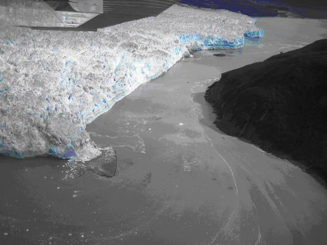

USACE personnel were recently notified by local boat captain Mark Sappington of sediment above the low tide limit in front of the tidewater terminus in the region between Disenchantment Bay and Russell Fjord. A reconnaissance flight of the glacier conducted on August 31, 2007 with local US Forest Service personnel confirmed this observation. A low, broad mound of sediment was visible above tidewater along one portion of its terminus (see Photo). Upon analysis of oblique aerial photos taken through te course of the summer season and discussions with glaciologist from CRREL the likely source of the sediments has been identified as a preferential subglacial water outlet discharging at the terminus margin. These outlets are capable of depositing large amounts of sedimentary materials and remain active throughout the summer melt seasons.

Continued monitoring of the terminus of Hubbard Glacier indicates that the glacier is currently in a temporary period of retreat. Even though the glacier is considered to be advancing, the well documented tidewater glacier cycle has shown that they typically advance from mid winter to late spring and typically retreat to a stable position during the late summer to early winter. According to the monitoring data, Hubbard Glacier has retreated a total of 70 m during the month of August leaving the gap 310 meters wide between Disenchantment Bay and Russell Fjord on August 31, 2007.

During this current period of retreat, the sediment observed appears to pose no immediate threat of closing the gap between Disenchantment Bay and Russell Fjord. The continued build up of material in front of the glacier could have consequences once the glacier begins its annual period of advancement. USACE personnel, along with personnel from CRREL and the University of Alaska Fairbanks, are planning to perform further monitoring and data collection efforts to determine the potential implications if sediment remains to build. Available satellite imagery, aerial photos from future reconnaissance flights, and the terminus monitoring data will be analyzed to document changes in the sediment and the position of the glacier terminus. A site visit scheduled for October will allow better assessment of sediments as well as water depths in the surrounding area. After the analysis of data collected during this site visit, a reassessment of the potential effects of the sediment on closure of the gap between Disenchantment Bay and Russell Fjord will be made. 

  

  

    
    

      Sediment visible above low tide in front of Hubbard Glacier. Credit: G Kalli, USACE.
    

  

  

