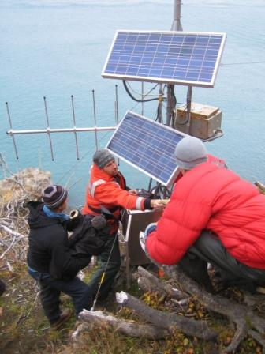
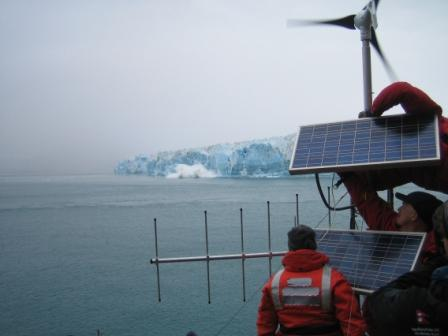
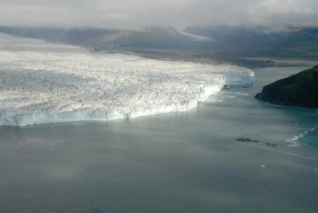
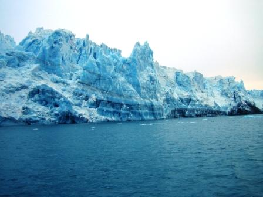

 During the Week of September 22nd maintenance visits were made to the Gilbert point ice monitoring system and the Haenke Island meteorological station. Team members included individuals from CRREL, the New England District COE, and the Alaska District COE office in Anchorage, the Geophysical Institute at the University of Alaska Fairbanks and a film crew for The History Channel. No significant modifications or upgrades were made outside of standard maintenance to ensure proper functionality through the winter months. Both sites were in good operating order except for minor bear damage to a solar panel at Gilbert Point.

  

  

    
    

      Regular maintenance of the Gilbert Point monitoring site, September 2007. Credit: Dave Finnegan, CRREL.
    

  

  

  

  

    
    

      Calving event in the background during regular maintenance of the Gilbert Point monitoring site, September 2007. Credit: Dave Finnegan, CRREL.
    

  

  

 In addition to site maintenance, a bathymetric survey was acquired in the vicinity of Gilbert Point by the Geophysical Institute, UAF the Army Corps of Engineers, Alaska District and CRREL to assess the overall bed conditions in relation to the ice marginal sediment seen during the late summer. At the current time, the ice margin has retreated from its previous position and it remains to be seen if bed conditions will have any influence on a potential closure in the spring.

  

  

    
    

      Aerial photograph of the gap between Hubbard Glacier and Gilbert Point.
    

  

  

  

  

    
    

      Calving event in the background during regular maintenance of the Gilbert Point monitoring site, September 2007. Credit: Dave Finnegan, CRREL.
    

  

  

