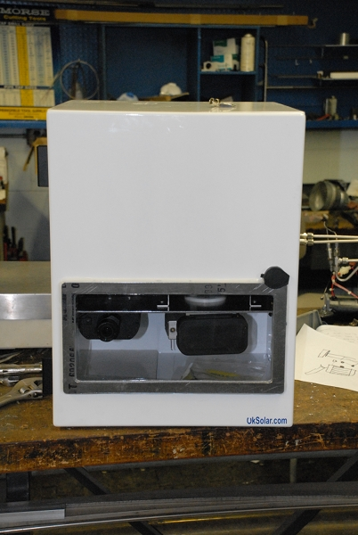
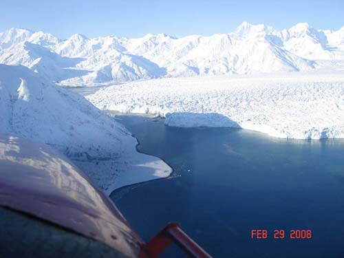
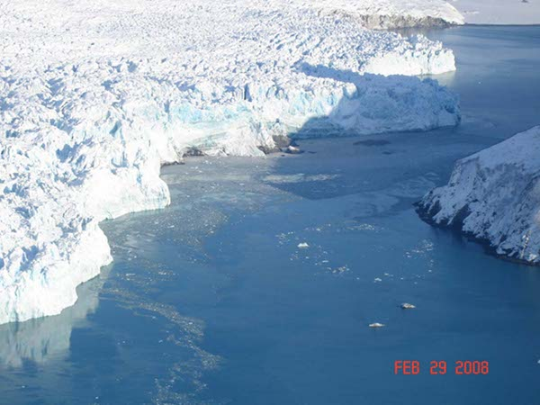

Spring is finally nearing and it looks as if the monitoring equipment at Hubbard Glacier and Haenke Island survived the long cold winter.
Our upgrades to the power systems last season worked as we hoped they would and power was never an issue, even during the darkest months.
The glacier terminus near Gilbert Point should be at a point where it is advancing and we hope the laser ranging unit will begin to return valid data very soon.
Measurements are begining to appear but difficult to determine if the measurements are valid or not.
The laser ranging unit is only capable of about 1000 m range in good conditions.
A team of researchers from CRREL, the New England Corps of Engineers and the Alaska District COE will return in late April to install an updated laser ranging system and a new high resolution imaging camera, which is a joint effort between our research team and the [Extreme Ice Survey](http://www.extremeicesurvey.org/) organization, an effort spear headed by James Balog and National Geographic.

  

  

    
    

      C. Grove USFS
    

  

  

  

  

    
    

      C. Grove USFS
    

  

  

  

  

    
    

      C. Grove USFS 
    

  

  

