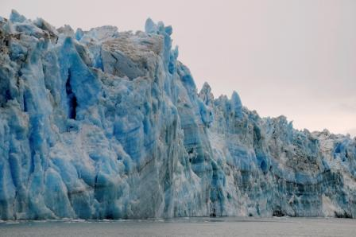
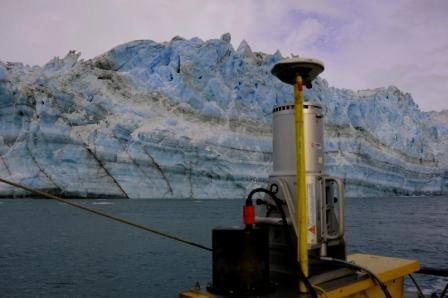

Researchers from CRREL and the US Army Corps of Engineers Coastal Hydraulics Lab in Vicksburg, MS visited Yakutat and the Hubbard Glacier to conduct a complete bathymetric mapping and LiDAR topography survey of the Gilbert Point terminus area. The work utilized an advanced Multi-beam Bathymetric mapping system, a precision 2-D current profiler and a long range ground-based LiDAR scanner all tied together to simultaneously map the submarine environment and tidewater glacier terminus. These data will provide a precision base map that will serve as a spring board for future oceanographic, marine geophysics and monitoring efforts. These efforts were funded by the USACE Alaska District. 

  

  

    
    

      Hubbard calving face during bathymetric mapping and LiDAR survey. Credit: Dave Finnegan, CRREL.
    

  

  

  

  

    
    

      Mobile LiDAR system surveying the Hubbard Glacier terminus. Credit: Dave Finnegan, CRREL.
    

  

  

