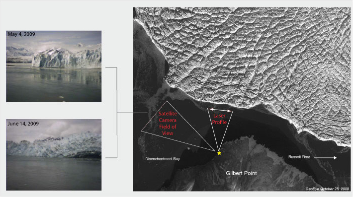

Researchers from the US Army Cold Regions Research and Engineering Lab visited Hubbard Glacier to conduct routine maintenance to the climate monitoring station at Haenke Island and the laser ranging system at Gilbert Point. In addition, several new pieces of equipment were installed to help monitor climate and glacier advance activity. A near real-time low-resolution satellite camera that acquires 3 images per day (1000, 1200 and 1400) was installed at Gilbert Point. The camera is directed 90 degrees to the west of where the laser ranging system is pointed, as to observe advancing activity that has been of interest since the summer of 2008. In addition, a second mechanical wind sensor was installed on Haenke Island for comparison measurements to an existing ultrasonic wind sensor that was thought to be malfunctioning. Both sensors seem to be operating normally. At the current time there is no rain gage installed at Haenke Island due to a malfunctioning switch.

  

  

    
    

      Satellite-linked camera and laser profiler fields-of-view as seen on a satellite image from October 25, 2008. Sample images from the satellite-linked camera.
    

  

  

