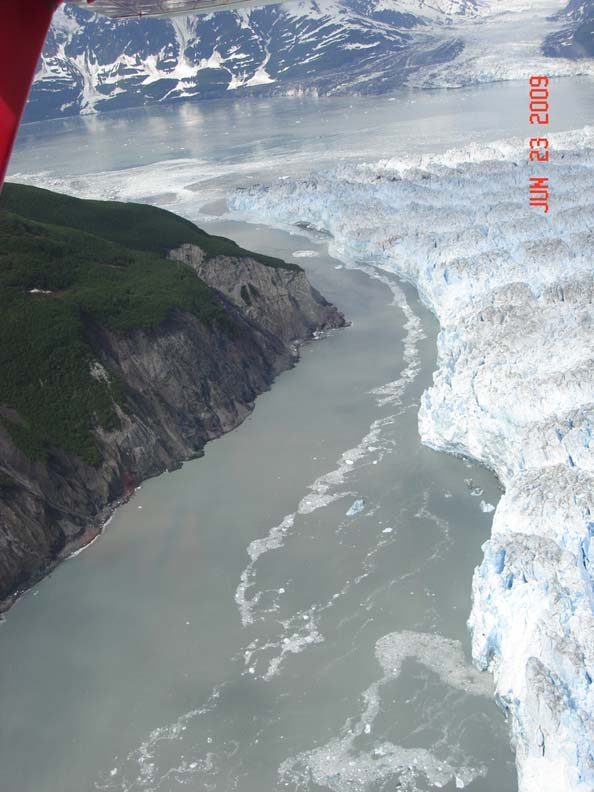
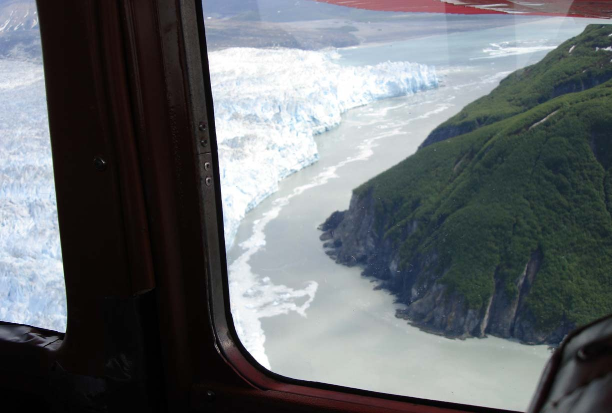

Photos of the Hubbard Glacier terminus. The glacier is wrapping around Gilbert Point. 

  

  

    
    

      Gap between Hubbard Glacier and Gilbert Point, June 23, 2009.
    

  

  

  

  

    
    

      Gap between Hubbard Glacier and Gilbert Point, June 23, 2009.
    

  

  

