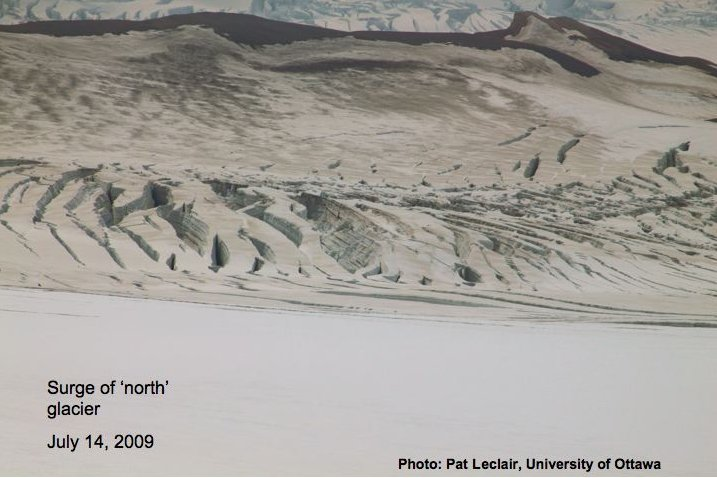

Dr Luke Copeland, University of Ottawa has provided the following info about three tributaries glaciers that feed into Hubbard Glacier that are currently surging. The surges are centered around Mt. Queen Mary (60 33'N, 139 50'W), and are in three parallel valleys. Local pilots reported these surges this winter (around Jan-Mar). There is significant crevassing, surface drawdown and strand lines. The terminus of Hubbard glacier was significantly advanced this year in comparison to the last three years of measurement and to date continues to show continued activity but slightly back from it's seasonal maximum. For information about the surges please contact Dr. Luke Copeland at the University of Ottawa or visit the contact links of this website.

  

  

    
    

	Credit: Lance Goodwin, Icefield Discovery.
    

  

  

  

  

    
    

	Credit: Lance Goodwin, Icefield Discovery.
    

  

  

  

  

    
    

	Credit: Pat Leclair, University of Ottawa.
    

  

  

  

  

    
    

	Credit: Pat Leclair, University of Ottawa.
    

  

  

  

  

    
    

	Credit: Pat Leclair, University of Ottawa.
    

  

  

  

  

    
    

	Credit: Lance Goodwin, Icefield Discovery.
    

  

  

  

  

    
    

	Credit: Pat Leclair, University of Ottawa.
    

  

  

