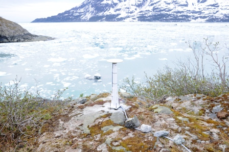
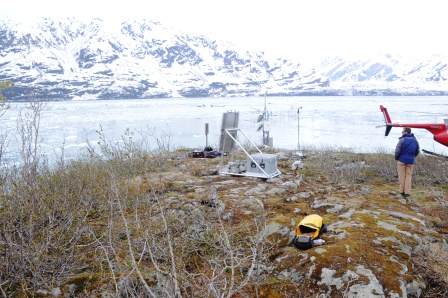
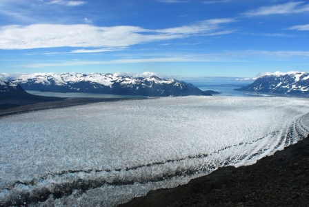

Researchers from the US Army Cold Regions Research and Engineering Lab, The University of Maine, the USGS Alaska Science Center and The University of Kansas visited Hubbard Glacier to conduct a campaign to monitor short and long duration glacier activity. These activities included deployment of on-ice GPS for monitoring short term (2-weeks) and long-term (seasonal) glacier velocities. The installation of a new GPS and seismic monitoring station at Haenke Island and new time-lapse and climate monitoring stations in the upper reaches of the glacier.

  

  

    
    

	Long-term monitoring GPS base station on Haenke Island. Credit: Dave Finnegan, CRREL.
    

  

  

  

  

    
    

	Long-term monitoring equipment on Haenke Island. Credit: Dave Finnegan, CRREL.
    

  

  

  

  

    
    

	Image from a time-lapse camera installed on the upper reaches of Hubbard Glacier.
    

  

  

