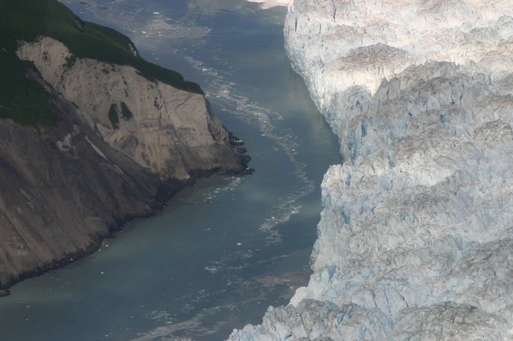
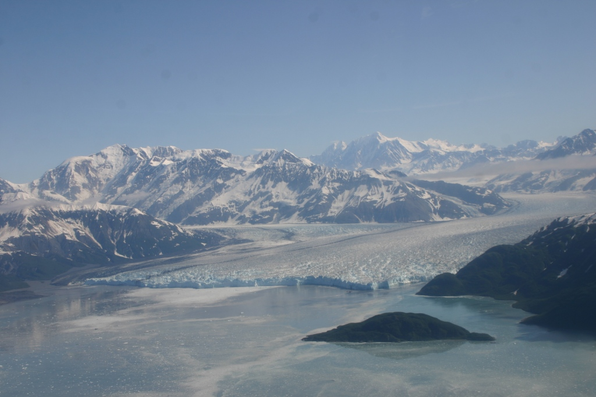
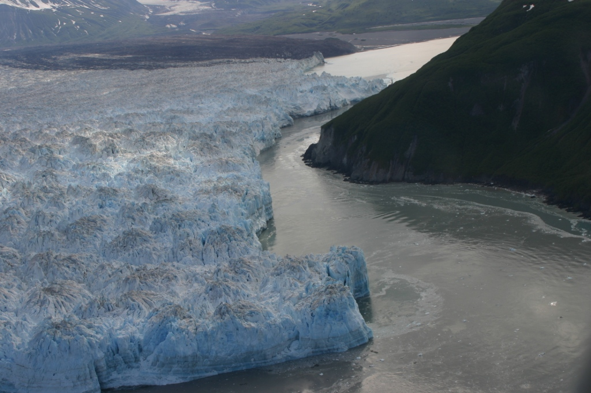
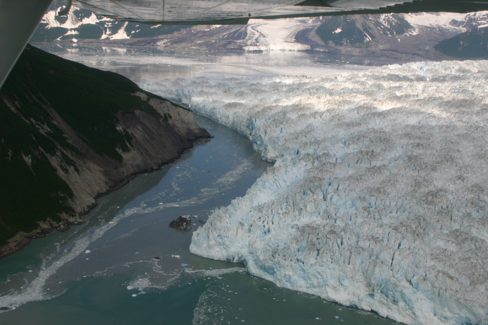
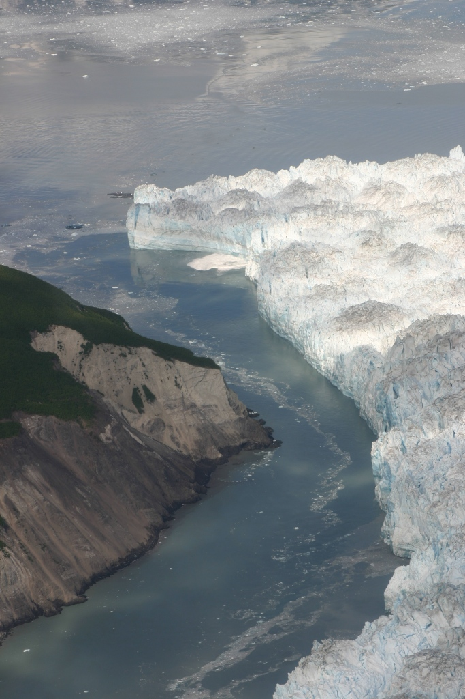

As sure as the seasons come and go Hubbard Glacier continues its advance towards Gilbert Point. After last years rather quiet season of activity Hubbard has advanced to within 100 meters of Gilbert point. Researchers at USACE CRREL, USGS and the University fo Maine are keeping a watchful eye on its activities. The photos below were taken on June 27, 2011 by CRREL (Dan Lawson). The ice face remains tall and near vertical across most of the terminus. The ice is wrapping itself around Gilbert Point in Russell Fiord and Disenchantment Bay, but the gap at the narrowest point is still about 75 to 80 m off the bedrock face. The ice near the shoal in Disenchantment Bay is being diverted to the east of it and toward Gilbert Point, creating the snout apparent in the image from the Disenchantment side of the channel. The ice face appears in many ways similar to 2009 but possibly with more ice encroaching on the shore at the head of Russell and Disenchantment Bay.

Our impression is that the glacier remains active in its seasonal advance but prediction of a closure occuring this season is still in question. Stay tuned for more information to come as information relating to Hubbard Glaciers activities is accumulated. 

  

  

    
    

	Gap between terminus and Gilbert Point. Credit: Dan Lawson, CRREL.
    

  

  

  

  

    
    

	Hubbard Glacier and Disenchantment Bay. Credit: Dan Lawson, CRREL.
    

  

  

  

  

    
    

	Hubbard Glacier wraps around Gilbert Point. Credit: Dan Lawson, CRREL.
    

  

  

  

  

    
    

	Hubbard Glacier wraps around Gilbert Point. Credit: Dan Lawson, CRREL.
    

  

  

  

  

    
    

	Hubbard Glacier wraps around Gilbert Point. Credit: Dan Lawson, CRREL.
    

  

  

