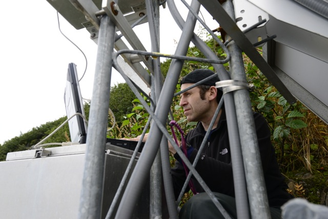
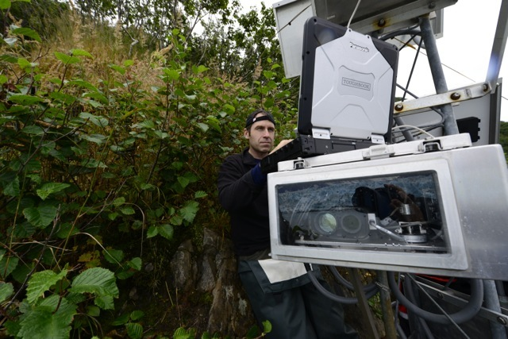
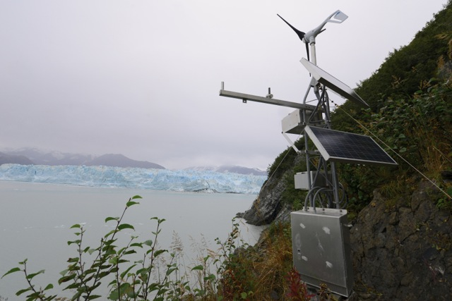

Sometimes 1-day in Yakutat is all we need to get out to Hubbard Glacier for site maintenance. That's exactly what Dave Finnegan and I did September 18th, on the tail-end of a week working up in Girdwood, AK testing our newly designed airborne LiDAR system. Arriving mid-day on the 18th, we immediately turned around and boarded a [Yakutat Charter Boat Company](http://www.alaska-charter.com) boat piloted by Mark Sappington, and headed to Gilbert Point. 

During the last visit in May 2014 our team cleared a safer, more stable path to the Gilbert Point station through the thick alders. Returning after the summer already the path is being reclaimed by nature, having grown over significantly. At the site we modified the Terminus Monitoring System's battery voltage logging, modified the web camera software to transmit images to our new FTP server, and tightened down the myriad of bolts and nuts that inevitably loosen due to high winds buffeting the station. Overall, the station is solid and strong.

Next we visited the Haenke Island site, which also has held up nicely since the last visit. We made some modifications to the solar radiation sensor, and downloaded images from the Canon time-lapse camera.

  

  

    
    

	Dave Finnegan (CRREL) modifies internal software at the Gilbert Point station. Credit: Adam LeWinter, CRREL
    

  

  

  

  

    
    

	Dave Finnegan (CRREL) modifies internal software at the Gilbert Point station. The laser profiler is visible through the enclosure window. Credit: Adam LeWinter, CRREL
    

  

  

  

  

    
    

	Gilbert Point station with the Hubbard Glacier terminus in the background. Credit: Adam LeWinter, CRREL
    

  

  

