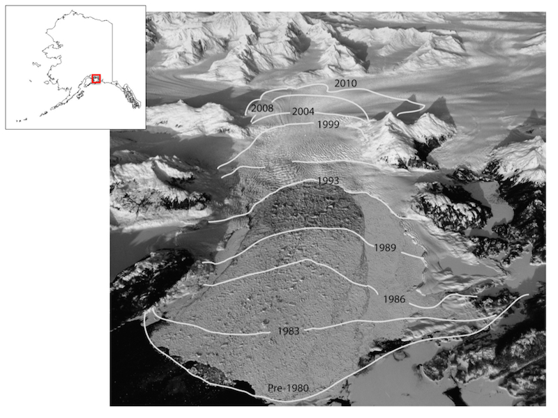
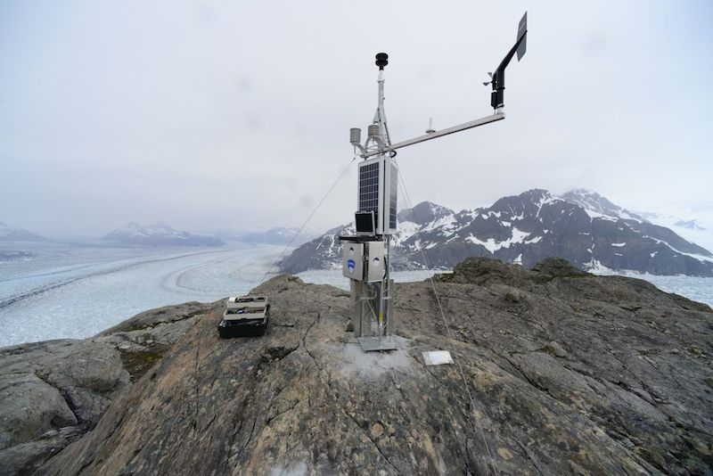
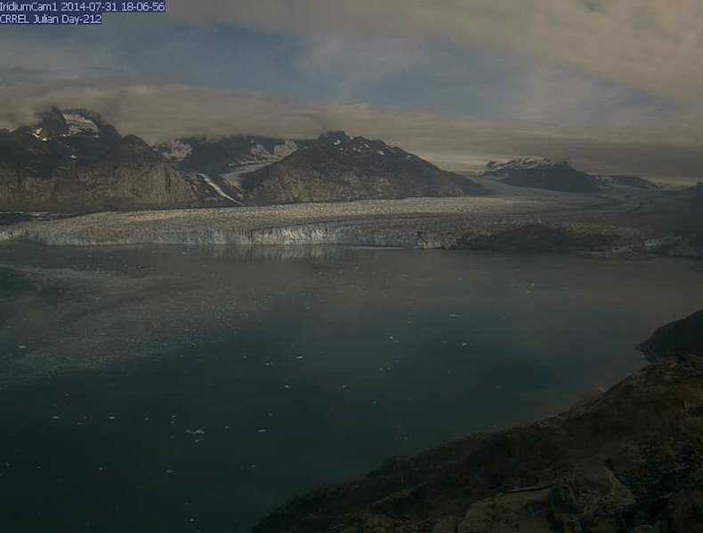

Columbia Glacier, located in Prince William Sound and the Chugach Mountains of Alaska, is the best-studied tidewater glacier on Earth. The approximately 900 square-kilometer glacier has many tributaries that flow together, and terminate at an ice cliff that is more than 7 kilometers across. Ice thickness is known to exceed 1,000 meters. Flow speeds are high, generally exceeding 20 meters/day at the calving front. Columbia Glacier is one of the largest point sources of glacier mass loss in the Alaska Region. Since rapid calving retreat began during the early 1980s, the glacier mass has decreased by approximately 120–150 cubic-kilometers water equivalent (w.e.). retreated over 20km, thinned by over 500 m at the present-day terminus, all told losing more than 50% of its original volume.
 
 

  

  

    
    

	Aerial photograph of Columbia Glacier, looking north. The white lines indicate the terminus position since the 1980's retreat. The terminus continues to retreat.
    

  

  

 
We have a satellite-linked camera located on Great Nunatak, southwest of the current terminus position of the main branch of Columbia. The camera relies on a light sensor to measure the ambient light. If there is sufficient light, the system powers on the camera, captures an image, and transmits the image to our servers via the Iridium satellite array. In addition, there is a climate station located up-glacier approximately 15km from the camera installation. Both stations transmit data multiple times/day, which can be viewed in near real-time on the [Real-time data](data.html) and [Time-lapse](timelapse.html) pages.
 
 

  

  

    
    

	Climate station installed above the Columbia Glacier. Data from this station can be viewed on the [Real-time data](data.html) page. Credit: Adam LeWinter, CRREL.
    

  

  

 

  

  

    
    

	Sample image from the Columbia Glacier satellite-linked camera. Images are uploaded daily from this camera, and can be viewed on the [Time-lapse](timelapse.html) page.
    

  

  

 
