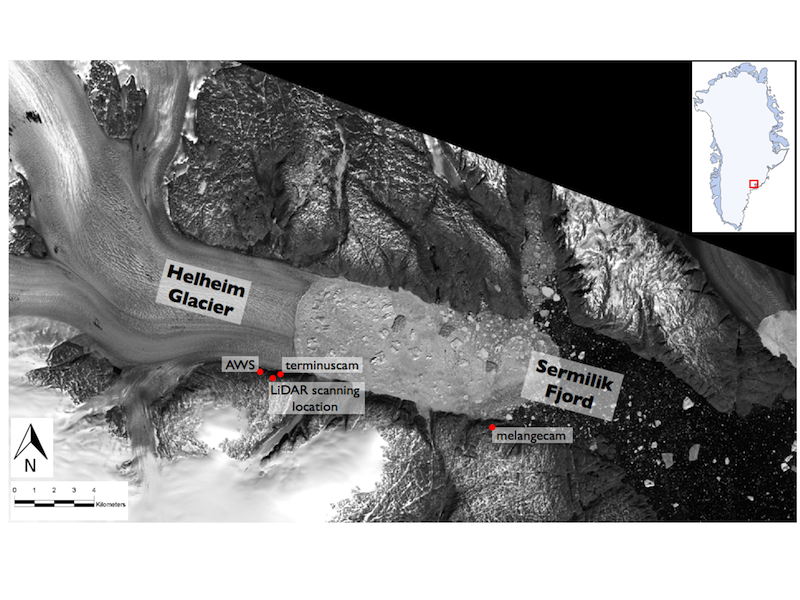
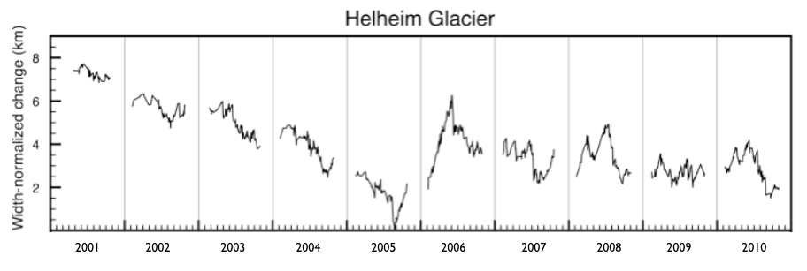
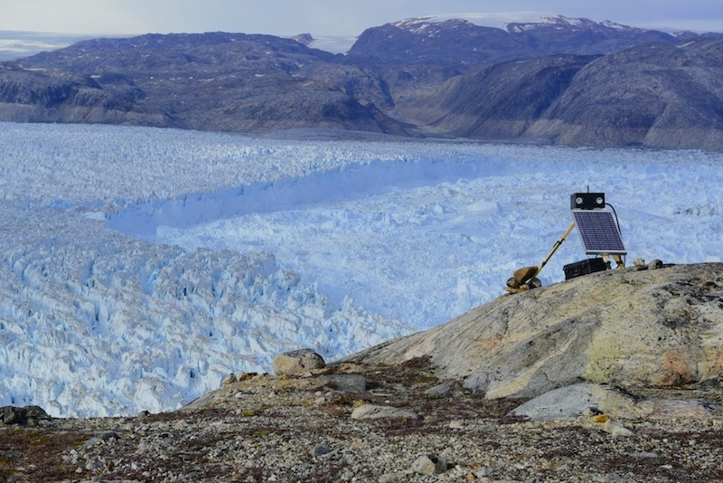
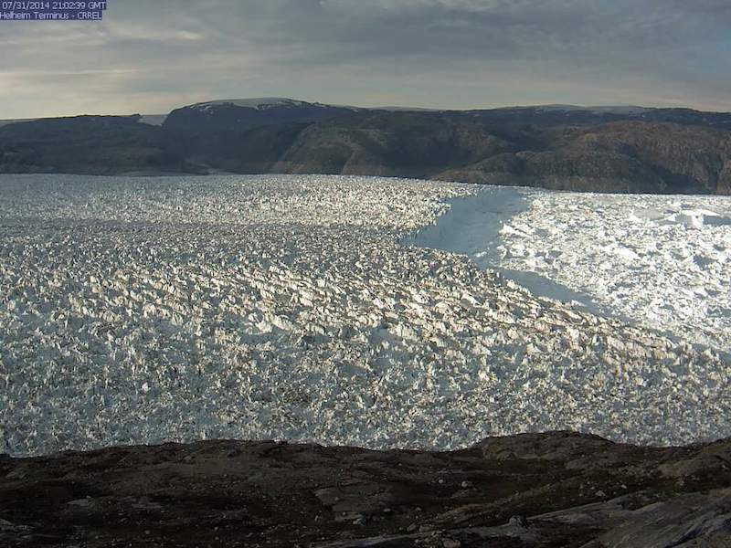

Helheim Glacier (66.38 N, 38.8 W) in southeast Greenland is one of the
ice sheet's largest outlet glaciers. In its lowermost 12 km, the glacier
flows through a steep-sided, ~6 km wide bedrock trough at speeds of up
to ~25 m/day. The glacier terminates in approximately 750 m of water at
the head of Sermilik Fjord, ~100 km from the open ocean. Like many of
Greenland's marine-terminating outlet glaciers, Helheim Glacier
underwent a series of rapid changes between 2002 and 2006, including an
~8 km terminus retreat, a near-doubling of flow speed, and thinning of
up to 200 m.

 

  

  

    
    

	Landsat 8 image of Helheim Glacier and Sermilik Fjord, collected June 11, 2014. Cameras, the automated weather station, and repeat LiDAR survey locations are indicated in red.
    

  

  

  

  

    
    

	Helheim terminus position change vs. time, derived from MODIS satellite imagery. Source: Schild, K.M. and Hamilton, G.S., 2013, Seasonal variations of outlet glacier terminus position in Greenland, Journal of Glaciology.	
    

  

  

 

We have visited Helheim Glacier every year since 2005 in an effort to
understand the controls on rapid outlet glacier change. Work has
included on-ice GPS surveys of flow speeds, near-situ monitoring of
glacier behavior (terrestrial LiDAR, time-lapse cameras), meteorological
observations, and hydrographic observations in the fjord and continental
shelf to understand coupling between the ice sheet and ocean.

We have two satellite-linked time-lapse cameras installed on bedrock on the south side of the glacier; one camera is focused on the terminus, and the other camera is focused on the melange, the calved icebergs and sea ice in contact with the terminus. The cameras rely on a light sensor to measure the ambient light. If there is sufficient light, the system powers on the camera, captures an image, and transmits the image to our servers via the Iridium satellite array. Near real-time images can be found on the [Real-time Images Terminus](realtime-images-terminus.html) and [Real-time Images Melange](realtime-images-melange.html) pages. There is an automated weather station (AWS) installed west of the terminus camera. The station transmits data multiples times/day, which can be viewed in near real-time on the [Real-time Data](data.html) page.
 
 

  

  

    
    

	Satellite-linked camera focused on the terminus of Helheim Glacier. Images are transmitted multiple times/day. Credit: Adam LeWinter, CRREL.
    

  

  

  

  

    
    

	Image from the Helheim Terminus camera, taken July 31, 2014.
    

  

  

