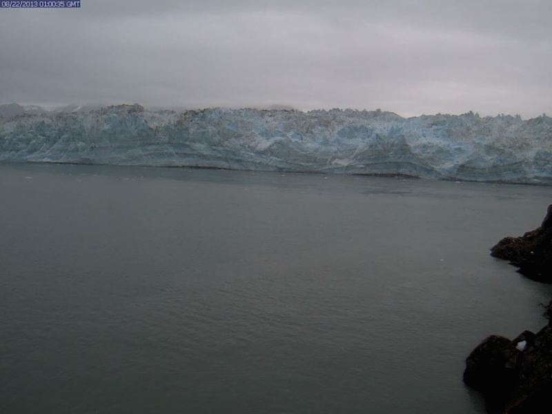

Located in eastern Alaska north of Yakutat, with its origins in Yukon, Canada, Hubbard Glacier is the largest tidewater glacier in North America. The highest source of snow accumulation is at approximately 11,000 feet, traveling 76-miles towards the 6-mile wide terminus at sea level in Disenchantment Bay and Russell Fjord. The terminus reaches as high as 100-meters above sea level, equivalent to the height of a 30-story building. Valerie Glacier joins Hubbard from the northwest approximately 6-miles from the terminus. Unlike the vast majority of glaciers, Hubbard Glacier has been both thickening and advancing since the International Boundary Commission first mapped it in 1895.
 
 

  

  

    
    

      Location of Hubbard Glacier, Valerie Glacier, Disenchantment Bay, and Russell Fjord.
    

  

  

  

  

    
    

      Hubbard Glacier terminus and Haenke Island in Disenchantment Bay. Credit: Adam LeWinter, CRREL
    

  

  

 
Twice in the recent past the terminus has dammed Russell Fjord by pinning proglacial sediment against Gilbert Point, first from June to October 1986, and more recently from June to August 2002. During both events, Russell Fjord’s water level rose significantly. This filling of Russell Fjord threatens to overtop the banks of the fjord, overflowing into the Situk River, flooding and eroding surrounding areas. A future damming event is likely given the glaciers continued advancing behavior.
 
 

  

  

    
    

      Hubbard Glacier closing the Russell Fjord (top right of image) opening to Disenchantment Bay (bottom of image) by pinning sediment against Gilbert Point on July 16, 2002. Credit: U.S. Geological Survey, the U.S. Forest Service, Yakutat Range District and National Park Service, Yakutat Ranger Station.
    

  

  

 
We have monitoring sites located on Haenke Island and Gilbert Point. Gilbert Point has a climate station, a laser ranging system for measuring the terminus distance from Gilbert Point, a satellite-linked time-lapse camera, and a high-resolution DSLR time-lapse camera. Haenke Island has a fully equipped climate station. These data are updated regularly and can be viewed in near real-time on the [Real-time data](data.html) and [Time-lapse](timelapse.html) pages.
 
 

  

  

    
    

      Image from the Hubbard Glacier terminus camera, transmitting daily images to the [Time-lapse](timelapse.html) page.
    

  

  

  

  

    
    

      Haenke Island Climate Station. Credit: Dave Finnegan, CRREL.
    

  

  

 

