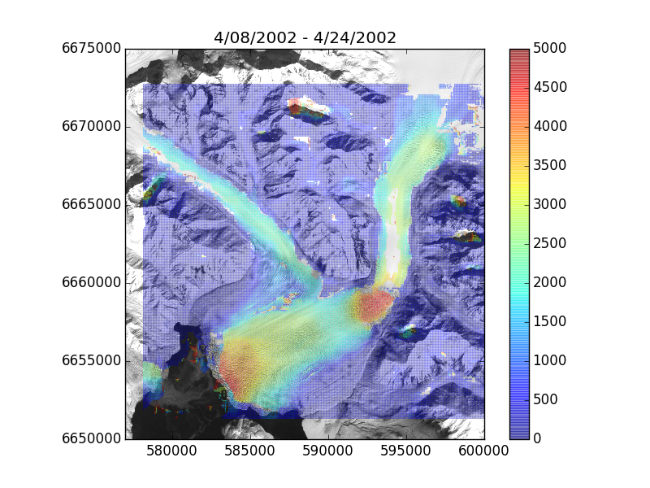

Ice velocity and terminus area data from 1972-2014, used in Stearns et al., 2015.

- Velocity data: [zip](velocity-data.zip) (32MB), [tgz](velocity-data.tgz) (32.1 MB)
- Velocity images: [zip](velocity-images.zip) (21.3MB), [tgz](velocity-images.tgz) (21.3MB)
- Terminus data: [csv](terminus-area.csv) (16KB)

  

  

    
  

    Velocities between 2002-04-08 and 2002-04-28.
  

  

  

