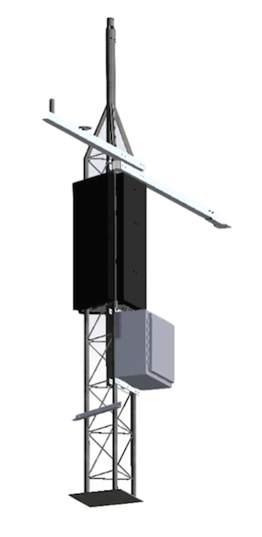
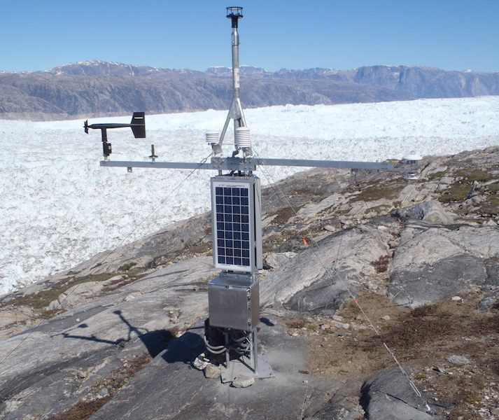
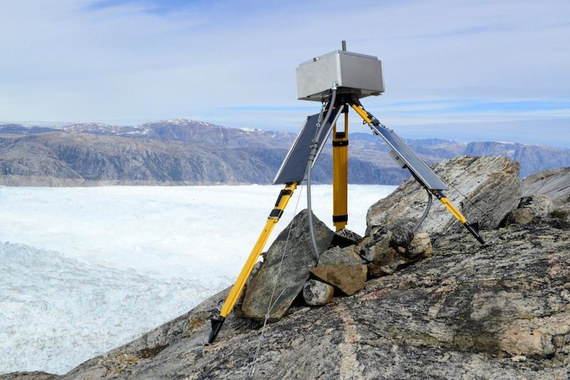
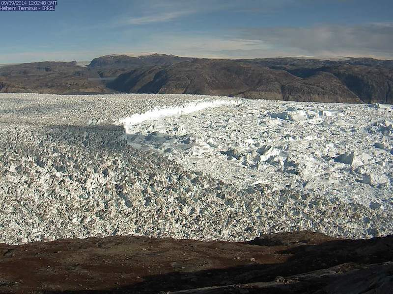
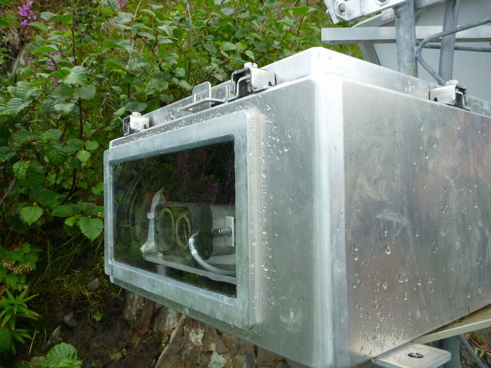
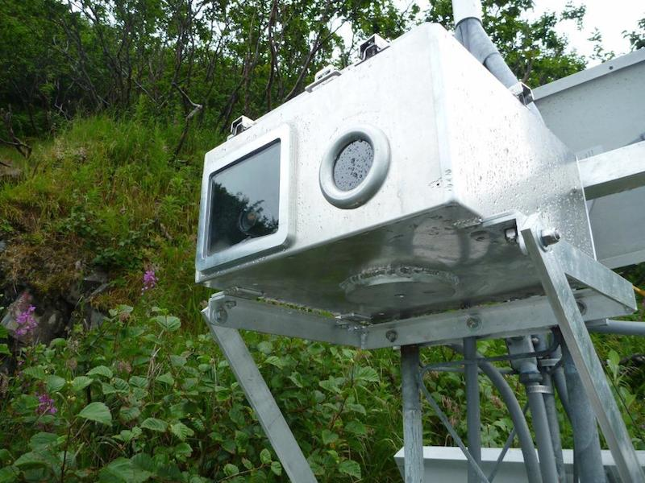
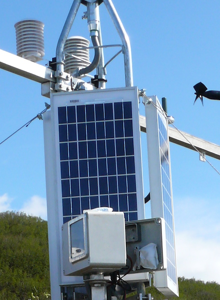

Each research location requires different observations and measurements to provide near real-time monitoring, necessitating multiple field-installed platforms. 

Jump to:

- [Climate Station](sensor-types.html#climate-station)
- [Satellite Linked Time-lapse Camera](sensor-types.html#satellite-linked-time-lapse-camera)
- [LiDAR Data](sensor-types.html#lidar-data)
- [Thermal Camera](sensor-types.html#thermal-camera)
- [Time-lapse Camera](sensor-types.html#time-lapse-camera)

### Climate Station

Our climate stations combine traditional local climate and atmospheric measurements with Iridium-linked satellite communication, providing near real-time updates of conditions at the study site. All stations have the following sensors: Air Temperature, Relative Humidity, Barometric Pressure, and Wind Speed/Direction. In addition, the climate station may have the following sensors: Snow Depth, Solar Radiation, and Precipitation Gauges. 

Photovoltaic solar panels, and at some stations wind generators, provide charging to a battery bank that powers the station. The station is controlled and data is logged by a Sutron data logger. Two-way communication is via an Iridium satellite modem, allowing for both the transmission of data to our servers and configuration of the system remotely.

Custom designed towers and guy wire assemblies ensure the stations can withstand gale force winds, high snowfall, and wildlife in the remote study locations. 
  
 

  

  

    
    

	CAD Model of a CRREL Climate Station. Every component is designed to both withstand the extreme conditions onsite, and be easily replaced during maintenance visits by our team.
    

  

  



  

  

    
    

	Climate station installed at Helheim Glacier, Greenland. Credit: Dave Finnegan, CRREL.
    

  

  

### Satellite Linked Time-lapse Camera

For monitoring of glacial movement, terminus location, and ice/ocean interactions, we have designed time-lapse cameras that transmit images back to our servers on a regular schedule, as often as every 4-hours. We use a Sutron data logger to control the camera and transmit images via an Iridium satellite modem. 

To account for changing daylight at high latitudes, summer has 24-hours of daylight while winter has long periods of darkness, we use a light-sensor to assess the amount of ambient light. If there is sufficient light, the system captures and transmits a photograph. If sufficient light is not available, the system remains in a low-power mode. Since the system's battery is recharged via a solar panel, times of low-light correspond with low-charging periods, working to conserve power through the winter months.

 

  

  

    
    

	Satellite linked time-lapse camera installed at Helheim Glacier, Greenland. Credit: Dave Finnegan, CRREL
    

  

  



  

  

    
    

	Image captured on September 9th, 2014, by the camera installed at Helheim Glacier, Greenland.
    

  

  



### LiDAR Data

To monitor the position of a glaciers calving face, we have developed a Terminus Monitoring System. Using laser ranging, the system collects multiple distance measurements of the calving face relative to the laser, which enables tracking of the calving face over time. Measurements are logged and sent to our servers via Iridium satellite. In particular, the seasonal advance of Hubbard Glacier, Alaska threatens to close off Russell Fjord, creating a dammed glacial lake. This system allows for near-constant monitoring of the Hubbard Glacier terminus, providing an early warning system for a potential closure event. See the [Hubbard Glacier Overview Page](hubbard/overview.html) for more information.

 

  

  

    
    

	Terminus Monitoring System installed on Gilbert Point, Hubbard Glacier, Alaska. Credit: Dave Finnegan, CRREL
    

  

  

### Thermal Camera

Similar to the Satellite Linked Time-lapse Camera, we have developed a remote time-lapse system using a thermal infrared camera, capturing surface temperatures of the focus area. The system captures and transmits images on a set schedule, and can be reconfigured remotely through two-way Iridium satellite communication. In addition, images can be captured an stored on the data logger at higher temporal intervals, able to be downloaded by our team during maintenance visits. A single enclosure is used for study sites with both the satellite linked visible light and thermal infrared time-lapse cameras.

 

  

  

    
    

	Thermal infrared and visible light time-lapse camera systems installed on Gilbert Point, Hubbard Glacier, Alaska. Credit: Dave Finnegan, CRREL
    

  

  

###Time-lapse Camera

In addition to the satellite linked time-lapse cameras, we have installed high-resolution DSLR time-lapse camera systems to capture images with improved detail. These systems must be revisited by our team to download the images, which may then be compiled into time-lapse animations.

 

  

  

    
    

	Time-lapse camera installed on Haenke Island, Hubbard Glacier, Alaska. Credit: Greg Hanlon, CRREL
    

  

  

